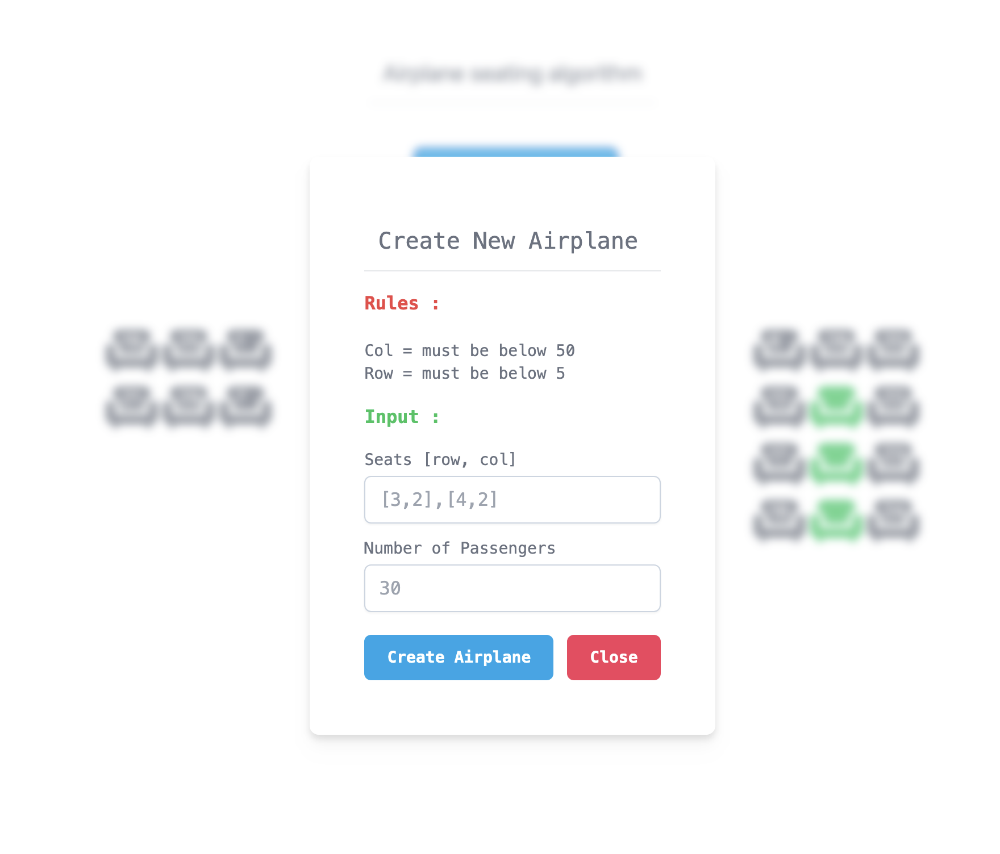
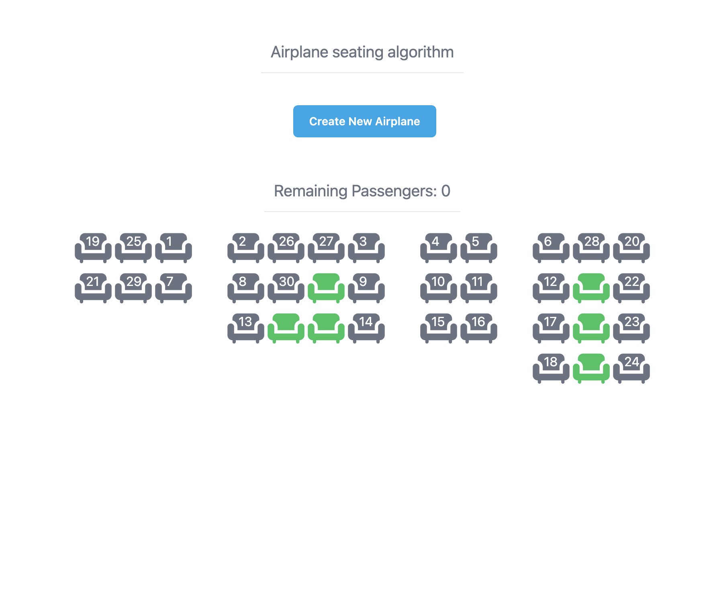

# Airplane Seating Algorithm

This project is an implementation of an algorithm for assigning seats on an airplane. It uses the React library and npm for package management.

## Getting Started

These instructions will get you a copy of the project up and running on your local machine for development and testing purposes.

### Prerequisites

- Node.js and npm (https://nodejs.org/en/)
- A recent version of React (https://reactjs.org/)

### Installation

1. Clone the repository:

- git clone https://github.com/Szakariia/Airplane_Algorithm.git

2. Navigate to the project directory:

- cd AirplaneSeatingAlgorithm

3. Install the required packages:

- npm start

## Usage

The application will start a development server and open in the browser. You can test the algorithm by inputting the number of rows and seats per row for the airplane, and then assigning passengers to seats.

## A screenshot of the application

